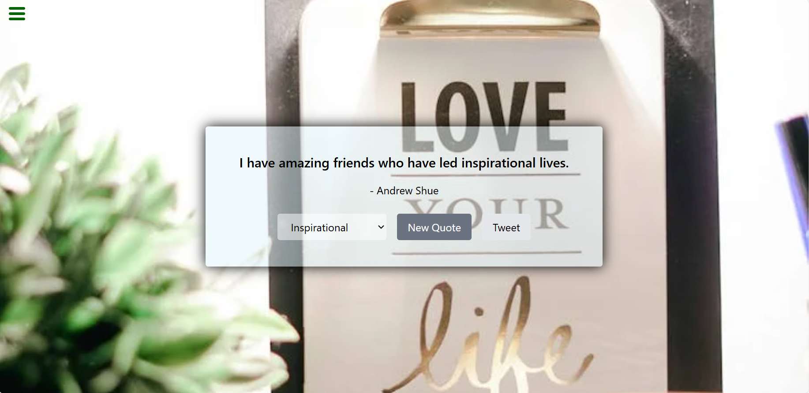

## Random-Quote-Machine

This is a React-based Random Quote Machine that displays a random quote from various categories. The app fetches quotes from the API Ninjas Quotes API and background images from the Pexels API. The project also includes a feature to share the quotes on Twitter.

## Features

 - Displays a random quote from various categories.
 - Fetches background images related to the selected category.
 - Allows users to select a category to filter quotes.
 - Provides a button to generate a new random quote.
 - Allows users to tweet the displayed quote directly.


## Technologies Used

 - **React:** Frontend library for building the user interface.
 - **Axios:** For making HTTP requests to fetch quotes and images.
 - **Tailwind CSS:** For styling the components.
 - **API Ninjas Quotes API:** For retrieving quotes.
 - **Pexels API:** For fetching background images based on the selected category.


## Live Demo


You can view a live demo of the project [here](https://quote-machine--quote-machine-p.netlify.app/)


## Installation

To run this project locally, follow these steps:

1. **Clone the repository**:
   ```bash
   git clone git@github.com:ZohalMirkhel/markdown-previewer.git
   ```
2. **Navigate to the project directory**:
   ```bash
   cd random-quote-machine
   ```

3. **Install the Required Dependencies**:
   ```bash
   npm install
   ```

4. **Get Your API Keys**:
   - **API Ninjas:** Sign up at API Ninjas and get your API key.
   - **Pexels:** Sign up at Pexels and get your API key.

5. **Create a .env file in the root directory and add your API keys:**:
   ```bash
   REACT_APP_PEXELS_API_KEY=your_pexels_api_key
   REACT_APP_API_NINJAS_KEY=your_api_ninjas_key
   ```

6. **Run the Project:**:
   ```bash
   npm start
   ```

## Usage

1. Upon loading, the app displays a random quote from the "inspirational" category along with a related background image.
2. Users can select a different category from the dropdown menu to view quotes specific to that category.
3. Click the "New Quote" button to generate another random quote and a new background image.
4. Click the "Tweet" button to share the quote on Twitter.

## Adjusting Styles

You can adjust the styling of the components by modifying the Tailwind CSS classes or adding custom styles in the App.js file.

## Contributing

If you'd like to contribute to this project, please fork the repository, make your changes, and submit a pull request. We welcome all contributions!

## Author

For any questions, feedback, or support, please contact me at:
- Email: [zohalmirkhel@gmail.com](mailto:zohalmirkhel@gmail.com)
- GitHub: [Zohal Mirkhel](https://github.com/ZohalMirkhel)
- LinkedIn: [Zohal Mirkhel](https://www.linkedin.com/in/zohal-mirkhel-840a7530a/)